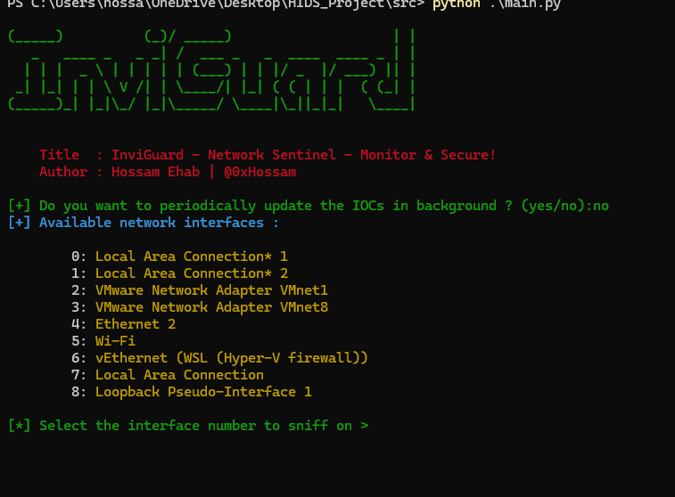

# InviGuard

***InviGuard is a network attack monitor that checks your device's network traffic and alerts you to any suspicious or malicious activity. It also helps secure your device from C2 network communications***

### Project Phases

- **Phase 1:** Gathering IP IOCs from various feed platforms
- **Phase 2:** Monitoring for network attacks & C&C communications with over 50 detection modules

***InviGuard is user-friendly and easily integrates with your security solutions through a simple API. It features a dashboard for viewing alerts, locations, severity, IP details, and modifying config settings easily. The dashboard also includes charts and statistics. Alerts can be exported directly in PDF, JSON, CSV, and HTML formats***

<div style="text-align: center; margin: 20px 0;">
    
</div>

# API Integration 

Integrate InviGuard with Your Product by using the InviGuard API to easily get all alerts and connect them to your applications

**Example**

```py
import requests
import json

# URL of the server
base_url = 'HTTP://IP:PORT'

def get_alerts():

    url = f'{ base_url }/get_alerts'
    response = requests.get( url )

    if response.status_code == 200:
        alerts = response.json()
        print('Alerts:', json.dumps( alerts , indent = 4 ))
    else:
        print(f'Failed to get alerts: { response.status_code }')
        print( response.text )

# Get all alerts
get_alerts()
```

**Example of the output format :**

~~~json
Alerts: [
    {
        "alert_type": "Unusual ARP Response Frequency",
        "count": 6,
        "description": "An unusually high frequency of ARP responses may indicate an ongoing ARP spoofing attack, where an attacker attempts to intercept, modify, or stop data in transit.",
        "details": "Possible ARP spoofing due to frequent ARP responses.",
        "src_ip": "192.168.201.50"
    },
    {
        "alert_type": "MITM Detected",
        "count": 14,
        "description": "Man-In-The-Middle (MITM) attacks involve an attacker secretly relaying and possibly altering the communication between two parties who believe they are directly communicating with each other.",
        "details": "ARP spoofing detected for IP 192.168.201.50: New MAC b4:b5:b6:98:bc:bf, Previous MACs {'b4:b5:b6:98:bc:bf'}",
        "src_ip": "192.168.201.21"
    }
]
~~~
## Completed Features

<div style="text-align: center; margin: 20px 0;">
    
</div>

### Network Monitoring and Alerting

* #### In-General

    - [x] User can select the network interface to monitor/alert based on it
    - [x] Capture network packets using Scapy
        - [x] Employ Scapy for capturing 
            - TCP
            - UDP
            - ICMP
            - ARP
            - DNS
            - DNSQR 
    - [x] Monitoring and printing network packets
    - [x] Utilizing logging mechanisms for network packet analysis
    - [x] Integration of detection modules for packet processing
    - [x] Identification of malicious source/destination IP addresses within network packets
    - [x] Periodically updating the IP IOCs and reloading the IPs list when modifucation happens
    - [x] Parallel execution of detection modules alongside network packet processing
    - [x] Enhancement of the alerting system to trigger Windows notifications upon detecting network attacks
    - [x] Support for exporting alerts in files
    - [x] Creating `configs.yml` file, enabling user-configurable API keys and other settings like setting custom thresholds for detection

* #### Network Detection

    - [x] ARP Spoofing Detection Module
    - [x] DHCP Spoofing Detection Module
    - [x] DNS Spoofing Detection Module
    - [x] SMB Relay Attack Detection Module
    - [x] ICMP Tunneling Attack Detection Module
    - [x] DNS Tunneling Attack Detection Module
    - [x] DDoS/DoS Attack Detection Module
    - [x] Port Scanning Detection Module
        - SYN scans
        - FIN scans
        - NULL scans
        - XMAS scans
        - UDP scans
    - [x] Man-In-The-Middle (MITM) Attack Detection Module
    - [x] TLS/SSL Monitoring for additional MITM attack detection
    - [x] Detecting HTTP Flooding Attacks
    - [x] Ports Monitoring Module
    - [x] IP Spoofing Detection Module
    - [x] MAC Spoofing Detection Module
    - [x] MAC Flooding Detection Module
    - [x] IP NULL Detection Module
    - [x] RST/FIN Flooding Detection Module
    - [x] DNS Hijacking Detection Module
    - [x] LLDP Spoofing Detection Module

* #### C2 Detection

    - [x] Detecting known malicious IP addresses from many IOCs Feeds Platform
    - [x] C2 Communication Detection via analysis of TLS values
    - [x] Detecting C2 Communications via DGA (Domain Generation Algorithm)
    - [x] Analyzing Network Flow
    - [x] Geo-Location Analysis & Detection Module
    - [x] P2P C2 Communication Detection Module
    - [x] LLMNR/NBT-NS Poisoning Detection Module
    - [x] HTTP/S Beaconing Detection Module
    - [x] Newly Registered Domain Detection Module
    - [x] HTTP Headers Analysis Module 
    - [x] Dns-Over-HTTP ( DoH ) Detection Module
    - [x] Detecting TOR Exit Nodes & It's Traffic

* #### IOC (Indicators of Compromise) Harvester

    * Integration with platforms to get all possible IP addresses from (IPs, URLs, Domains, Hostnames) from:

        - [x] AbuseIPDB
        - [x] AlienVault OTX (Open Threat Exchange)
        - [x] ThreatFox
        - [x] TweetFeed for real-time threat intelligence
        - [x] URLHaus
        - [x] VXVault

    - [x] Writing all the IOCs in data/ip.txt file

* #### Alerting

    * ##### Supported Formats:

        - [x] PDF
        - [x] JSON
        - [x] CSV
        - [x] HTML

    * ##### Alerting Functionality:

        - [x] Easy direct calling
        - [x] Creates system warning messages if there are attacks
        - [x] Using Flask endpoint to save alerts there for APIs & UI
        - [x] Offering detailed descriptions for every attack that occurs

* #### UI Dashboard

    * ##### General Features
        - [x] View all alerts
        - [x] Modify and add configurations
        - [x] Display statistics and charts for alerts, including their frequency and numbers
        - [x] Show charts for the severity of triggered attacks
        - [x] Provide an attack map to trace the geo-locations of attacks

    * ##### Plugins
        - [x] Display total unique IPs
        - [x] Show total number of alerts
        - [x] List total alert types

## The End

This project is made with love by Hossam Ehab, also licensed under the MIT license and all rights reserved.
